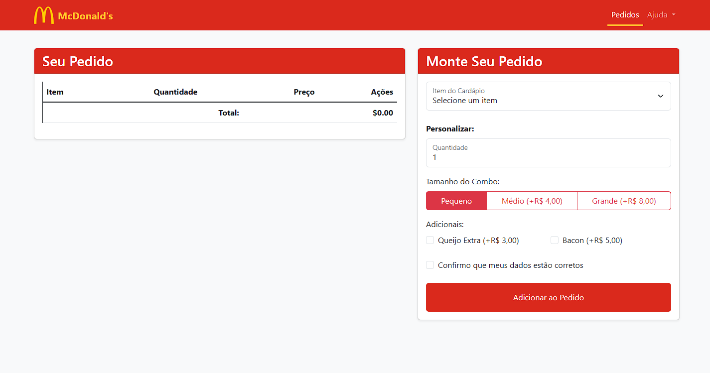

# Desafio Bootstrap

Este projeto consiste em uma página web estilizada com Bootstrap, contendo diversos elementos de interface para praticar e demonstrar o uso da biblioteca.

## 📌 Requisitos Implementados
- [x] **Navbar**: Menu de navegação responsivo.
- [x] **Tabela**: Estruturada e estilizada com classes do Bootstrap.
- [x] **Formulário**:
  - Campos input com rótulos flutuantes.
  - Checkbox.
  - Radiobutton.
  - Caixa de seleção (Dropdown).
  - Botão de envio.
- [x] **Mensagens de alerta**: Utiliza componentes de alerta do Bootstrap.
- [x] **Modal**: Exibe uma janela modal ao clicar no botão do formulário.

## 🖼️ Captura de Tela
Adicione uma imagem do projeto aqui:



## 🚀 Tecnologias Utilizadas
- **HTML5**
- **CSS3**
- **Bootstrap 5**

## 📂 Como Executar o Projeto
```sh
git clone https://github.com/seu-usuario/nome-do-repositorio.git
cd nome-do-repositorio
start index.html
```

---
Desenvolvido por [Gabrielsb1] 😊